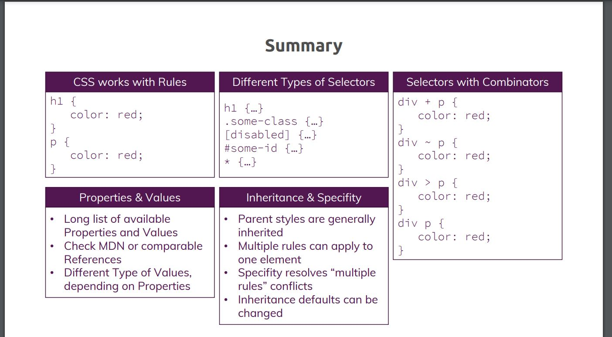

# CSS Practice

## 1. Current Reading
section 1: chapter 7

## Learn CSS
### Section 1: Getting Started
- Tools needed to learn CSS
  - CODE Editor like VS Code
  - Browser like Chrome
- Useful Resources & Links
  - World Wide Web Consortium (W3C) CSS Working Groups: https://www.w3.org/TR/tr-groups-all#tr_Cascading_Style_Sheets__CSS__Working_Group
  - Download Visual Studio Code: https://code.visualstudio.com/
  - Download Google Chrome: https://www.google.com/intl/en/chrome/

### Section 2: Diving Into the Basics of CSS
- In this section, we will learn How to
  - Add CSS to HTML
      1. In-Line style, using style attribute
          - Not recommended in bigger project, as it will hard to manage code
      2. Style in head section
      3. Using an external style-sheet
  - Setting up CSS Rules
  - Selectors, Properties & Values
  - Resolve conflicting styles
- Different kinds of selectors
  - Elements
  - Classes
  - Universal
  - IDs
  - Attributes
- CSS Specificity
  - Some rules of precedence defined in CSS
- Inheritance
  - Add common style in body tag
- Adding Combinators
  - (+) Adjacent siblings
  - (~) General siblings
  - (>) Child
  - ( ) Descendant
- Useful Resources & Links
  - Complete MDN CSS Reference (don't learn this by heart!): https://developer.mozilla.org/en-US/docs/Web/CSS/Reference
  - Do you prefer reading? Find written CSS docs on MDN: https://developer.mozilla.org/en-US/docs/Web/CSS
  - Common CSS Properties Reference: https://developer.mozilla.org/en-US/docs/Web/CSS/CSS_Properties_Reference
  - CSS Combinators: https://developer.mozilla.org/en-US/docs/Learn/CSS/Introduction_to_CSS/Combinators_and_multiple_selectors
  - More details on CSS Specifity: https://developer.mozilla.org/en-US/docs/Web/CSS/Specificity

- [section-02-css-selectors.pdf](./section-2-summary/section-02-css-selectors.pdf)
- [section-02-css-inheritance.pdf](./section-2-summary/section-02-css-inheritance.pdf)
- [section-02-css-specificity.pdf](./section-2-summary/section-02-css-specificity.pdf)
- [section-02-css-combinators.pdf](./section-2-summary/section-02-css-combinators.pdf)
- [section-02-css-value-types.pdf](./section-2-summary/section-02-css-value-types.pdf)
- [section-02-basics-summary.pdf](./section-2-summary/section-02-basics-summary.pdf)

### Section 3: Diving Deeper into CSS

### Section 4: More on Selectors & CSS Features

### Section 5: Practicing the Basics

### Section 6: Positioning Elements with CSS

### Section 7: Understanding Background Images & Images

### Section 8: Sizes & Units

### Section 9: Working with JavaScript & CSS

### Section 10: Making our Website Responsive

### Section 11: Adding & Styling Forms

### Section 12: Working with Text and Fonts

### Section 13: Adding Flexbox to our Project

### Section 14: Using the CSS Grid

### Section 15: Transforming Elements with CSS Transforms

### Section 16: Transitions & Animations in CSS

### Section 17: Writing Future-Proof CSS Code

### Section 18: Introducing Sass (Syntactically Awesome Style Sheets)

### Section 19: Course Roundup

