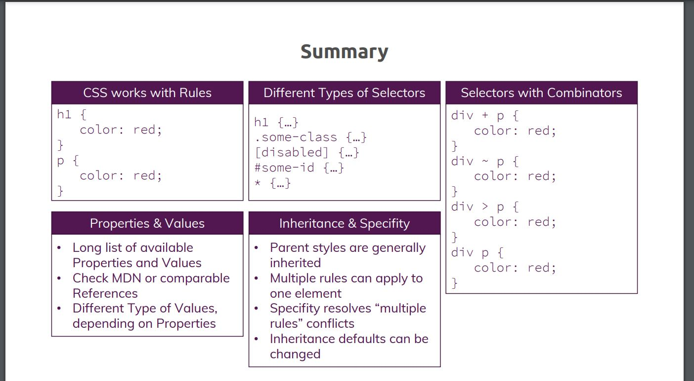

# CSS Practice

### Current Reading
  - section 4: chapter 55 (took notes)
  - section 8: chapter 112 (listen only)

## Learn CSS
### Section 1: Getting Started
- Tools needed to learn CSS
  - CODE Editor like VS Code
  - Browser like Chrome
- Useful Resources & Links
  - World Wide Web Consortium (W3C) CSS Working Groups: https://www.w3.org/TR/tr-groups-all#tr_Cascading_Style_Sheets__CSS__Working_Group
  - Download Visual Studio Code: https://code.visualstudio.com/
  - Download Google Chrome: https://www.google.com/intl/en/chrome/

### Section 2: Diving Into the Basics of CSS
- In this section, we will learn How to
  - Add CSS to HTML
      1. In-Line style, using style attribute
          - Not recommended in bigger project, as it will hard to manage code
      2. Style in head section
      3. Using an external style-sheet
  - Setting up CSS Rules
  - Selectors, Properties & Values
  - Resolve conflicting styles
- Different kinds of selectors
  - Elements
  - Classes
  - Universal
  - IDs
  - Attributes
- CSS Specificity
  - Some rules of precedence defined in CSS
- Inheritance
  - Add common style in body tag
- Adding Combinators
  - (+) Adjacent siblings
  - (~) General siblings
  - (>) Child
  - ( ) Descendant
- Useful Resources & Links
  - Complete MDN CSS Reference (don't learn this by heart!): https://developer.mozilla.org/en-US/docs/Web/CSS/Reference
  - Do you prefer reading? Find written CSS docs on MDN: https://developer.mozilla.org/en-US/docs/Web/CSS
  - Common CSS Properties Reference: https://developer.mozilla.org/en-US/docs/Web/CSS/CSS_Properties_Reference
  - CSS Combinators: https://developer.mozilla.org/en-US/docs/Learn/CSS/Introduction_to_CSS/Combinators_and_multiple_selectors
  - More details on CSS Specifity: https://developer.mozilla.org/en-US/docs/Web/CSS/Specificity


- [section-02-css-selectors.pdf](../section-2-summary/section-02-css-selectors.pdf)
- [section-02-css-inheritance.pdf](../section-2-summary/section-02-css-inheritance.pdf)
- [section-02-css-specificity.pdf](../section-2-summary/section-02-css-specificity.pdf)
- [section-02-css-combinators.pdf](../section-2-summary/section-02-css-combinators.pdf)
- [section-02-css-value-types.pdf](../section-2-summary/section-02-css-value-types.pdf)
- [section-02-basics-summary.pdf](../section-2-summary/section-02-basics-summary.pdf)


### Section 3: Diving Deeper into CSS
- Working with boxes
  - Every element in CSS is interpreted as box. It has 1) content, 2)padding, 3)border, and 4)margin
  - Two types of elements. 1)Block level, 2)In-line
  - Deep Dive on "Margin Collapsing"
    - When working with margins, you can get unexpected results.
      - Why are two adjacent elements sharing one margin even though each element has its own one?
      - Why does a parent element (e.g. <section>  as in the videos) suddenly take on the margin of the child element (e.g. ```<h1>``` )?
    - It's always related to margin collapsing. You can dive deeply into it with the help of the following awesome article: https://developer.mozilla.org/en-US/docs/Web/CSS/CSS_Box_Model/Mastering_margin_collapsing
    - There, three base cases are described:
      1. Adjacent siblings which both have margins
      2. A parent which holds one or more child elements where the first and/ or last (or the only) child has margins
      3. An element without content, padding, border and height 
    - Let's explore these cases:
      1. __Adjacent Siblings__
          - In this case, the first element might have a margin of 10px  (on all sides let's say) and the second one has 5px  (or 20px  - the values don't matter).
          - CSS will collapse the margins and only add the bigger one between the elements. So if we got margins of 10px  and 5px , a 10px  margin would be added between the elements?
      2. __A parent with children that have a margin__
          - To be precise, the first and/ or last or the only child has to have margins (top and/ or bottom). In that case, the parent elements margin will collapse with the child element(s)' margins. Again, the bigger margin wins and will be applied to the parent element.
          - If the parent element has padding, inline content (other than the child elements) or a border, this behavior should not occur, the child margin will instead be added to the content of the wrapping parent element.
      3. __An empty element with margins__
          - This case probably doesn't occur that often but if you got an element with no content, no padding, no border and no height, then the top and bottom margin will be merged into one single margin. Again, the bigger one wins.
- __Shorthand properties__
  - Combine values of multiple properties in a single property (the shorthand property)
- pseudo classes and elements
  - https://developer.mozilla.org/en-US/docs/Learn/CSS/Building_blocks/Selectors/Pseudo-classes_and_pseudo-elements
- Useful Resources & Links
  - CSS Box Model: https://developer.mozilla.org/en-US/docs/Learn/CSS/Introduction_to_CSS/Box_model
  - box-sizing : https://developer.mozilla.org/en-US/docs/Web/CSS/box-sizing
  - More on height & width: https://www.w3schools.com/css/css_dimension.asp
  - The display  Property: https://developer.mozilla.org/en-US/docs/Web/CSS/display
  - Pseudo Classes on the MDN: https://developer.mozilla.org/en-US/docs/Web/CSS/Pseudo-classes
  - Dive deeper into Pseudo Elements: https://developer.mozilla.org/en-US/docs/Web/CSS/Pseudo-elements


### Section 4: More on Selectors & CSS Features
- Useful Resources & Links
  - A discussion on "classes vs IDs": https://stackoverflow.com/questions/12889362/difference-between-id-and-class-in-css-and-when-to-use-it
  - When is using !important  okay? => https://css-tricks.com/when-using-important-is-the-right-choice/
  - The :not()  pseudo class: https://developer.mozilla.org/en-US/docs/Web/CSS/:not
  - Can I Use: https://caniuse.com/
  
### Section 5: Practicing the Basics

### Section 6: Positioning Elements with CSS

### Section 7: Understanding Background Images & Images

### Section 8: Sizes & Units

### Section 9: Working with JavaScript & CSS

### Section 10: Making our Website Responsive

### Section 11: Adding & Styling Forms

### Section 12: Working with Text and Fonts

### Section 13: Adding Flexbox to our Project

### Section 14: Using the CSS Grid

### Section 15: Transforming Elements with CSS Transforms

### Section 16: Transitions & Animations in CSS

### Section 17: Writing Future-Proof CSS Code

### Section 18: Introducing Sass (Syntactically Awesome Style Sheets)

### Section 19: Course Roundup


